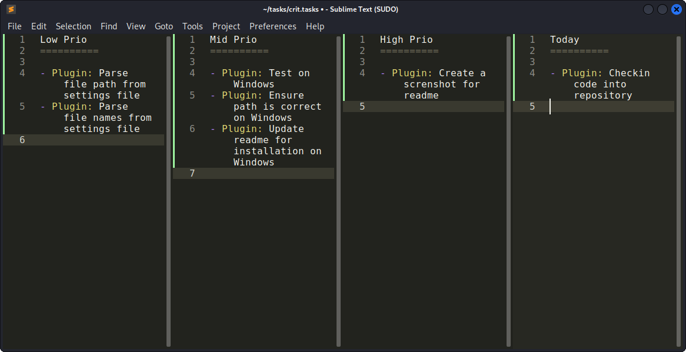

# Sublime Text Tasks Plugin

## Description

A plugin that allows to manage, sort and order tasks inside priority based lists.

## Usage

### Main Usage

Just edit the text inside the files. Save changes using "File > Save All"

### Supporting Shortcuts

Move a task to the next higher priority list

	select line of task to move
	press "tab"

Move a task to the next lower priority list

	select line of task to move
	press "shitf + tab"

Select higher priority pane

	press "alt + right"

Select lower priority pane

	press "alt + left"

> Shortcuts only work for .tasks files. So they have no impact on all other files that you edit.
> Limitation: 1 Task per line (Otherwise you are not able to move them correctly using the "tab" shortcut)

### Styling Hints

If you follow these style hints for your tasks then they get colored nicely

	- <tasktitle>: <taskcontent>

> Of course you are free to do wathever you want and need

## Setup

> Currently in beta state. Manual installation needed!

Copy the files from this repository to the following folder

	<sublime-text-user-folder>/Packages/TaskPlugin/

Create a Tasks folder

	mkdir ~/Documents/tasks/

If required update the folder path inside "TaskPlugin.py"

	TASKSFolder="~/Documents/tasks/"

Create the following files inside the Tasks Folder

- low.tasks
- mid.tasks
- high.tasks
- today.tasks

> you can add any titles inside the files to match your requirements

Open the Tasks Plugin

	Ctrl + P > Search for: "Tasks: Open Tasks View"

## Works On

Tested on the following Systems

	Linux: Sublime Text Version 4200